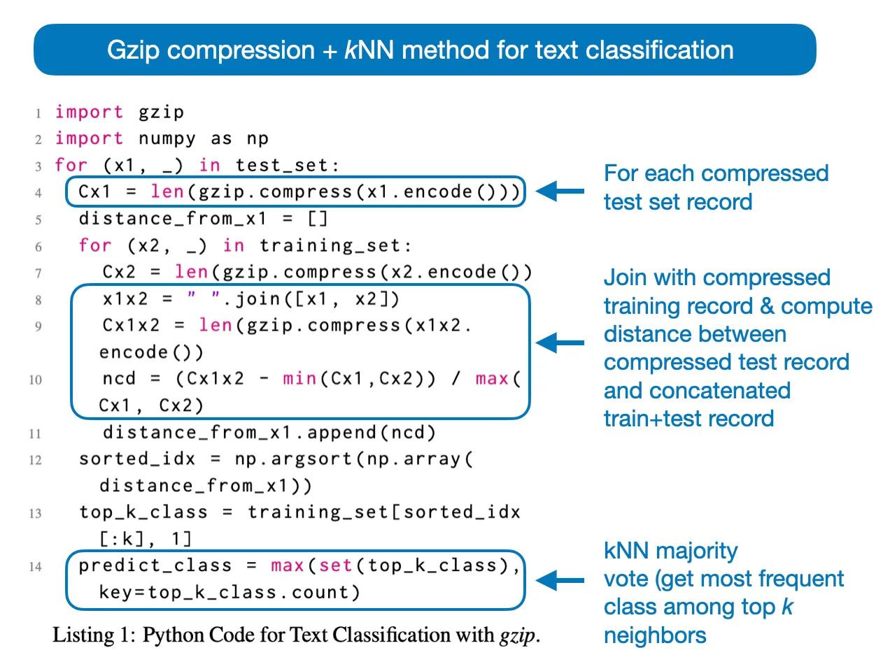
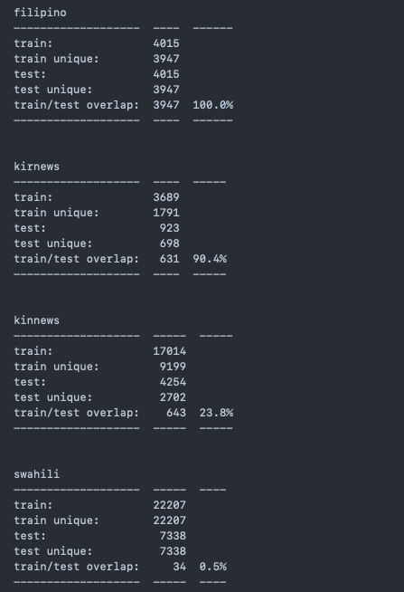

# Text classification using lossless compression (gzip)

- To keep it short, we want to classifiy texts using gzip and kNN
- the gzip method leverages the fact that compression algorithms remove redundant information within text sequences

### (1) How does the method work?

- Suppose we have two texts $t_1, t_2$ where:

```python
t_1 = "hello world"
t_2 = "some text some text some text"

# Compress individual texts
len(gzip.compress(txt_1.encode()))  # Output: 31
len(gzip.compress(txt_2.encode()))  # Output: 33

# Compress concatenated texts
len(gzip.compress(" ".join([txt_1, txt_2]).encode()))  # Output: 43

# Compress text concatenated with itself
len(gzip.compress(" ".join([txt_1, txt_1]).encode()))  # Output: 34
len(gzip.compress(" ".join([txt_2, txt_2]).encode()))  # Output: 33
```

- We notice, that the second compressed text is slightly longer despite being much longer originally.
- This demonstrates how the compression algorithm takes advantage of repeated text.

### (2) Fixing Tie-Breaking

- A common problem in k-nearest neighbors classification is breaking ties when `k=2`. The method in the original paper always selects the lowest class label in case of a tie, which introduces bias:

```python
top_k_class = [0, 1]
max(set(top_k_class), key=top_k_class.count)  # Output: 0

top_k_class = [1, 0]
max(set(top_k_class), key=top_k_class.count)  # Output: 0

top_k_class = [1, 0, 2]
max(set(top_k_class), key=top_k_class.count)  # Output: 0
```

- A more rational approach uses the `Counter` object to select the closer neighbor, since we sort the distances in a list

```python
from collections import Counter

top_k_class = [0, 1]
Counter(top_k_class).most_common()[0][0]  # Output: 0

top_k_class = [1, 0]
Counter(top_k_class).most_common()[0][0]  # Output: 1

top_k_class = [1, 2, 0]
Counter(top_k_class).most_common()[0][0]  # Output: 1
```

- Using the second approach can improve accuracy up to a decent amount

The full approach can be demonstrated as follows:


### (3) Results

- the results strongly depend on the compression ratio of the dataset, since compression ratios and test accuracies have a positive linear correlation meaning that the easier a dataset can be compressed, the better accuracy can be achieved.

### (4) Efficiency Improvements

- Gzip has a limited sliding window size for searching repeated strings. This limitation becomes apparent when dealing with large datasets (e.g., 20News) as the compressor may not capitalize the quantity of training samples.

- Moreover, the computational complexity of kNN is $\Theta(n^2)$, which becomes a significant limitation as the data size increases.

- Additionaly, caching the compressed training instances and parallelizing the search across GPU cores reduce runtime significantly, from 12 to 2 hours on the IMDb Movie review dataset.

### (5) Final Thoughts

- this method is cool, since it relies on CPU resources, eliminating negative environmental impacts related to GPU usage.
- since the run-time doesn't scale well on large datasets, we can make use of multiprocessing techniques.
- Dataset Overlapping: The datasets used in the original paper had a dataset overlaping issue  leveraging wrong results for train/test accuracies.
